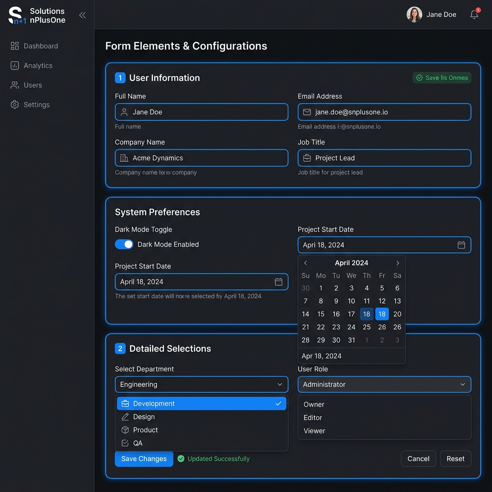
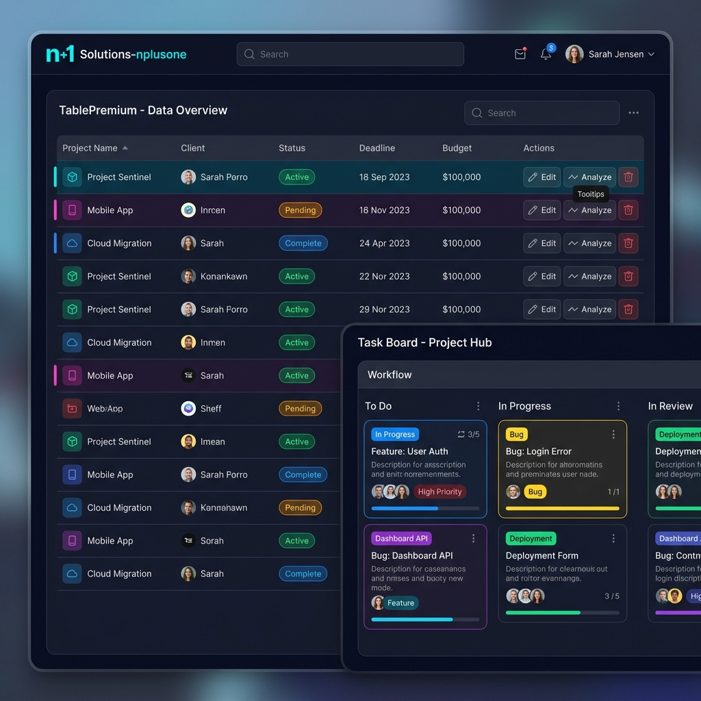

# 🎨 Galería Visual de Componentes - SolutionsNplusOne

Bienvenido al catálogo visual de componentes del **Engine-Render**. Aquí puedes previsualizar cómo se ven los elementos que configuras mediante JSON.

---

## 📝 Formas y Entradas (Forms)
Componentes para la captura de datos con diseño premium y validación integrada.

> [!TIP]
> Puedes encontrar los esquemas técnicos en: [`/templates/componentes/forms/`](./forms)

---

## 📊 Tablas y Gestión de Datos (Data)
Visualización avanzada de información mediante grillas premium y tableros Kanban.

> [!TIP]
> Puedes encontrar los esquemas técnicos en: [`/templates/componentes/data/`](./data)

---

## 🛠️ Navegación por Categorías
Haz clic en cada carpeta para ver los archivos JSON técnicos de cada componente:

-   📂 **[Core](./core)**: Títulos, separadores y facturas (Invoices).
-   📂 **[Forms](./forms)**: Inputs, selectores, carga de archivos y fechas.
-   📂 **[Data](./data)**: Tablas premium, productos y tableros Kanban.
-   📂 **[Specials](./specials)**: Firma digital (Draw) y estados de error.

---

## 🧠 ¿Cómo usar estos ejemplos?
1.  Copia el contenido del archivo `.json` que necesites.
2.  Pégalo en el campo `configurationUi` de tu respuesta del backend.
3.  El motor lo renderizará automáticamente con el diseño premium mostrado en las imágenes.
